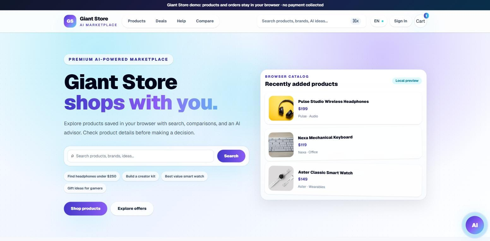
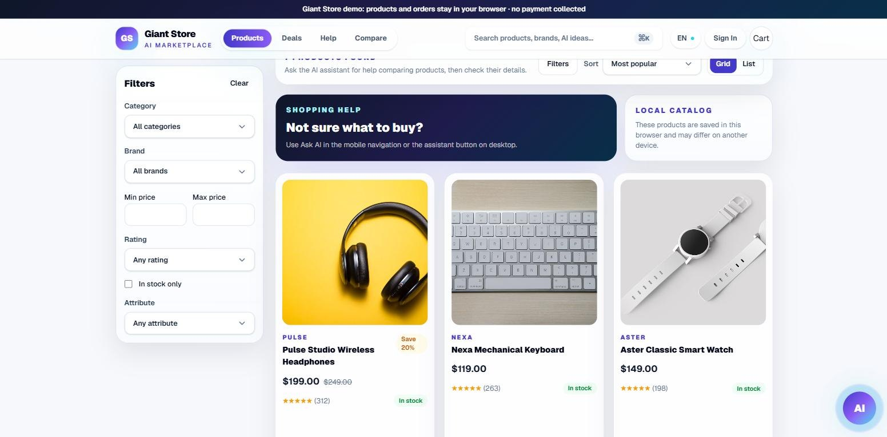
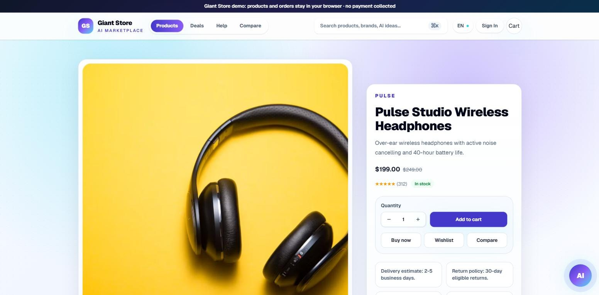
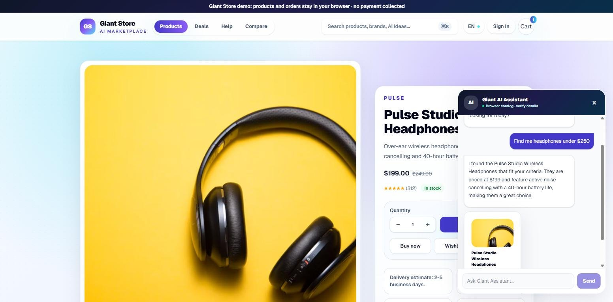
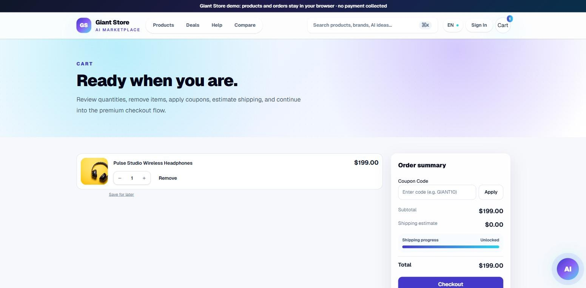
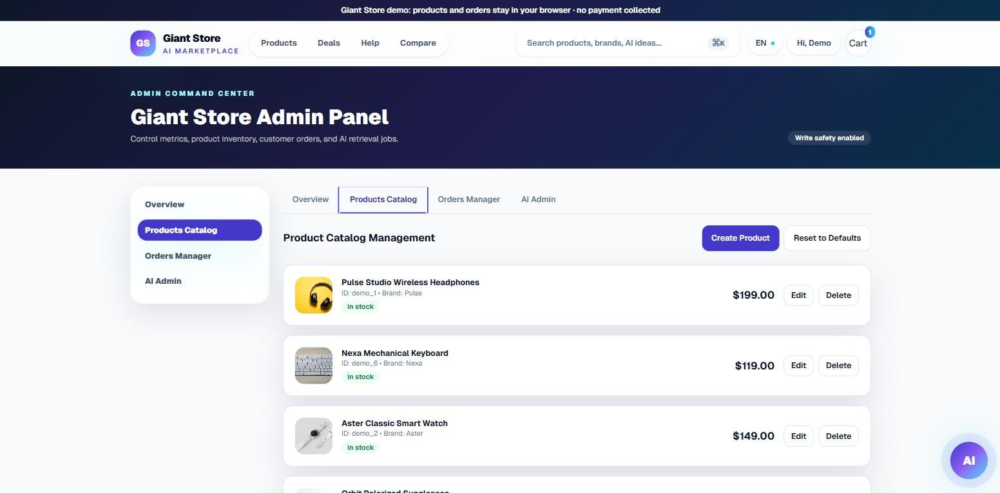
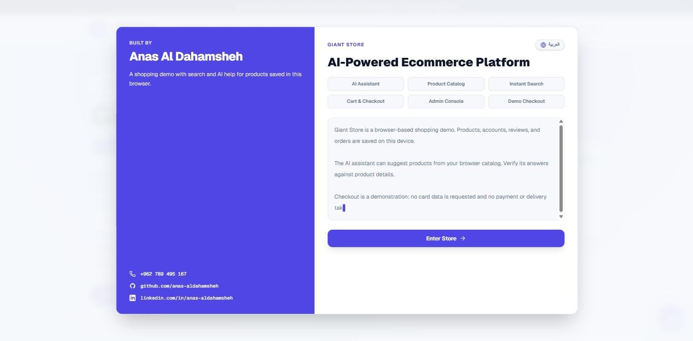

<div align="center">


### AI-Powered E-Commerce Platform

A modern, fully interactive online store built with **Next.js App Router**, **TypeScript** and **Tailwind CSS**, featuring an **AI shopping assistant** powered by Google Gemini with local RAG retrieval.

[](LICENSE)


**Engineered by Anas Aldahamsheh — تطوير: أنس الدحامشة**



</div>

---

## 📖 Overview

Giant Store is a full-featured e-commerce front end that runs **100% locally** — no external database or backend setup required. Accounts, products, cart, orders, wishlist and comparisons are persisted in the browser, so you can clone the project and have a complete shopping experience running in under a minute.

The store starts with an **empty catalog**: sign in as the store administrator and add products from the **Admin dashboard** — they instantly appear across the storefront, search and the AI assistant.

The optional AI assistant helps shoppers find products through natural conversation. It retrieves relevant products from the catalog (RAG) and uses **Google Gemini** to generate recommendations. If no API key is configured, it automatically falls back to a built-in local product advisor, so the feature always works.

---

## ✨ Features

### 🛒 Shopping Experience
- Home page with hero section, featured categories, campaign banners, smart bundles and product showcases
- Product listing with **filters, sorting, pagination** and grid / list views
- Product details page with reviews, ratings, stock status and quick view
- Category pages, **deals** page and instant **search** overlay
- **Product comparison** tool
- **Cart** with coupons and shipping progress, multi-step **checkout** with order confirmation

### 👤 Accounts & Admin
- Register, login, forgot / reset password flows (simulated locally)
- Account dashboard with **orders history**, **wishlist** and **reviews**
- Role-based **Admin dashboard**: metrics overview, product catalog management (create / edit / delete), orders manager and AI admin

### 🤖 AI Shopping Assistant
- Floating chat assistant available on every page, with suggested prompts
- **RAG pipeline**: product catalog is chunked, embedded locally and retrieved per request
- **Google Gemini** integration for natural-language product recommendations
- Automatic **fallback advisor** when no API key is set
- Understands **Arabic and English** queries with automatic RTL / LTR message direction
- Built-in **rate limiting** and response sanitization (only real catalog products are recommended)

### 🎨 UI / UX
- Polished, responsive design with a reusable UI component library
- Smooth animations with **Framer Motion** (respects reduced-motion preferences)
- Bilingual (English / Arabic) welcome screen
- Loading, empty, error and 404 states

---

## 📸 Screenshots

| Product catalog | Product details |
|:---:|:---:|
|  |  |
| **AI shopping assistant** | **Cart** |
|  |  |
| **Admin dashboard** | **Welcome screen** |
|  |  |

---

## 🧰 Tech Stack

| Layer | Technology |
|---|---|
| Framework | [Next.js 16](https://nextjs.org/) (App Router) |
| UI | [React 19](https://react.dev/) + TypeScript |
| Styling | [Tailwind CSS v4](https://tailwindcss.com/) |
| State management | [Zustand](https://zustand.docs.pmnd.rs/) + React Context |
| Validation | [Zod](https://zod.dev/) |
| Animation | [Framer Motion](https://www.framer.com/motion/) |
| Icons | [Lucide](https://lucide.dev/) |
| AI | [Google Gemini API](https://ai.google.dev/) + local RAG |
| Testing | [Vitest](https://vitest.dev/) |
| Code quality | ESLint + Prettier |

---

## 🚀 Getting Started

### Prerequisites

- **Node.js 20.9+** (Node 22 LTS recommended — see [`.nvmrc`](.nvmrc))
- **npm** (comes with Node.js)

### Installation

```bash
# 1. Clone the repository
git clone https://github.com/anas-aldahamsheh/AI-Giant-store.git
cd AI-Giant-store

# 2. Install dependencies
npm install

# 3. Create your environment file
cp .env.example .env        # on Windows (PowerShell): copy .env.example .env

# 4. Start the development server
npm run dev
```

Then open **[http://localhost:3000](http://localhost:3000)** in your browser.

### Environment Variables

All variables are documented in [`.env.example`](.env.example).

| Variable | Required | Description |
|---|---|---|
| `NEXT_PUBLIC_SITE_URL` | No | Public base URL of the site (default `http://localhost:3000`) |
| `APP_ENV` | No | Environment label (default `local`) |
| `GEMINI_API_KEY` | No | Google Gemini API key for the AI assistant — get one at [Google AI Studio](https://aistudio.google.com/apikey). Without it the local fallback advisor is used |
| `TRUST_PROXY_IP_HEADERS` | No | Set to `true` only behind a trusted reverse proxy (used by the AI rate limiter) |
| `ADMIN_EMAIL` | No | Email of the store administrator. Together with `ADMIN_PASSWORD` it turns on the administrator sign-in |
| `ADMIN_PASSWORD` | No | The administrator's password. It is checked on the server only and never reaches the browser |

> ⚠️ Never commit your real `.env` file. It is already excluded by `.gitignore`.

### Accounts

Visitor accounts are simulated in the browser: register any account, or sign in with any email and a demo code of at least six characters. They are stored in that browser only.

The store administrator signs in with `ADMIN_EMAIL` and `ADMIN_PASSWORD` from the server's environment. The password is checked on the server, so it is never part of the code sent to the browser. Without both values there is no administrator sign-in.

### Adding products

1. Sign in with the administrator's email and password — you are redirected to `/admin`.
2. Open **Products Catalog** → **Create Product** and fill in the details (image URLs from Unsplash work out of the box).
3. Products are saved in your browser and appear immediately in the store, search and AI assistant.

---

## 📜 Available Scripts

| Command | Description |
|---|---|
| `npm run dev` | Start the development server |
| `npm run build` | Create an optimized production build |
| `npm run start` | Run the production build |
| `npm run test` | Run the test suite (Vitest) |
| `npm run lint` | Lint the codebase with ESLint |
| `npm run typecheck` | Type-check with TypeScript (no emit) |
| `npm run format` | Format all files with Prettier |
| `npm run format:check` | Check formatting without writing |

---

## 🗂️ Project Structure

```txt
.
├── public/               # Static assets: logo and screenshots
└── src/
    ├── app/              # App Router pages, layouts, API routes, icons & OG image
    │   ├── api/          #   ├─ ai/chat, ai/rag, health, upload
    │   ├── account/      #   ├─ orders, wishlist, reviews
    │   ├── admin/        #   ├─ admin dashboard
    │   ├── products/     #   ├─ listing & product details
    │   └── ...           #   └─ cart, checkout, search, compare, deals, auth pages
    ├── components/
    │   ├── ui/           # Reusable UI primitives (Button, Modal, Tabs, Drawer, ...)
    │   ├── layout/       # Header, Footer, MegaMenu, MobileNav, ...
    │   ├── animation/    # Framer Motion animation components
    │   └── motion/       # Motion-safe helpers
    ├── config/           # Site configuration & creator metadata
    ├── features/         # Feature modules (components, hooks, stores, services, tests)
    │   ├── ai-assistant/
    │   ├── auth/
    │   ├── cart/
    │   ├── checkout/
    │   ├── compare/
    │   ├── home/
    │   ├── products/
    │   ├── search/
    │   └── wishlist/
    ├── lib/
    │   ├── ai/           # Gemini provider, prompts, RAG (chunks, embeddings, retrieval), fallback advisor
    │   ├── api/          # API client & response helpers
    │   ├── utils/        # Utilities (cn, text direction, ...)
    │   └── ...
    ├── styles/           # Global styles & Tailwind design tokens
    └── types/            # Shared TypeScript types
```

---

## 🧪 Testing

```bash
npm run test        # unit tests
npm run typecheck   # type safety
npm run lint        # code quality
```

Tests live next to the features they cover, under `src/**/__tests__/`.

---

## 📄 License

This project is licensed under the [MIT License](LICENSE).

---

## 👨‍💻 Author

**Anas Aldahamsheh — أنس الدحامشة**

- 📞 Phone: `+962 789 495 167`
- 💼 LinkedIn: [linkedin.com/in/anas-aldahamsheh](https://www.linkedin.com/in/anas-aldahamsheh)
- 🐙 GitHub: [github.com/anas-aldahamsheh](https://github.com/anas-aldahamsheh)

---

<div align="center">

⭐ If you like this project, consider giving it a star!

</div>
